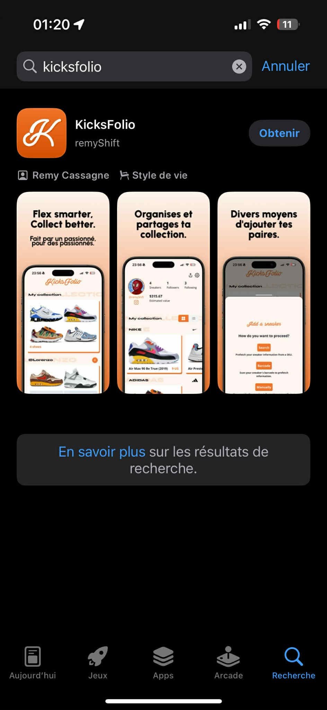
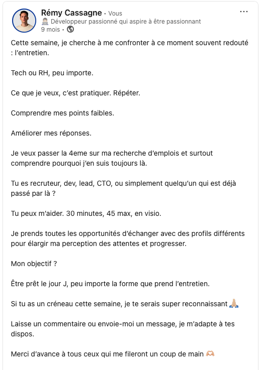

<!--
=================================================
  SLIDE 1 — COVER
=================================================
-->

  

  

  
Rémy Cassagne - LyonCraft 2026

  

  <h1 class="cover-title">Développeur  par obstination</h1>
    <h3 class="cover-sub">
      Ou comment les galères valent mieux que les filières
    </h3>
  

<!--
Phrase d'intro 
-->

---
layout: center
title: "Question d'accroche"
---
<!-- ================================================
     SLIDE 2 — QUESTION D'ACCROCHE
================================================= -->

  
Comment passe-t-on de <strong>vendeur de surgelés porte à porte</strong> à <strong>dev fullstack en production</strong> sur un site e-commerce avec des milliers d'users ?

---
layout: center
title: "Le parcours"
---
<!-- ================================================
     SLIDE 3 — LE PARCOURS
================================================= -->

  

    
Pas de bac. Pas de diplômes.

    
Deux piscines de l'école 42 échouées.

    
Une école abandonnée. Un bootcamp.

    
Six mois sans mission et des centaines de refus.

    
Et pourtant, me voilà devant vous.

  

<!-- Transition : Je vais vous expliquer pourquoi tout ce qui n'a pas marché
est exactement ce qui m'a construit -->

---
layout: statement
title: "La thèse"
---
<!-- ================================================
     SLIDE 4 — THÈSE
     ================================================ -->

<h3 class="thesis-text" v-motion :initial="{ opacity: 0, y: 20 }" :enter="{ opacity: 1, y: 0, transition: { duration: 700 } }">
  Ce qui m'a construit comme développeur, 
  c'est pas la formation que j'ai suivie. 
  C'est tout ce que j'ai traversé avant, pendant, et autour.
</h3>

---
layout: center
title: "Plan du talk"
---
<!-- ================================================
     SLIDE 5 — PLAN DU TALK
     ================================================ -->

<h1 class="plan-title">Aujourd'hui en 3 actes :</h1>

  

    

    

      <h3 class="plan-act">Acte 1</h3>
      <h4 class="plan-label">Ce que la vente m'a appris avant le code</h4>
    

  

  

    

    

      <h3 class="plan-act">Acte 2</h3>
      <h4 class="plan-label">Les portes fermées comme moteur</h4>
    

  

  

    

    

      <h3 class="plan-act">Acte 3</h3>
      <h4 class="plan-label">Arriver en prod sans filet</h4>
    

  

---
layout: full
title: "Acte 1 - Ce que la vente m'a appris avant le code"
---
<!-- ================================================
     SLIDE 6 — SECTION ACTE 1 - Ce que la vente m'a appris avant le code
     ================================================ -->

<Door
  color="#52b788"
  darkColor="#2d6a4f"
  number="ACTE 01"
  act="Acte 1"
  title="Ce que la vente m'a appris avant le code"
/>

---
layout: cover
title: "La vente porte à porte"
---
<!-- ================================================
     SLIDE 7 — SETUP VENTE
     ================================================ -->

<SequenceBlock badge="" badge-color="#52b788" title="La vente porte à porte">
  <TimelineItem v-click>
    
Inconnus -> Rentrer chez des gens qu'on connaît pas.

  </TimelineItem>
  <TimelineItem v-click>
    
Terrain difficile -> Circulation, accès à certains lieux ...

  </TimelineItem>
  <TimelineItem v-click variant="blocked">
    
Refus constants -> Mauvais résultats.

  </TimelineItem>
</SequenceBlock>

---
layout: cover
title: "Compétence 1 - Définir le besoin"
---
<!-- ================================================
     SLIDE 8 — COMPÉTENCE 1 - Définir le besoin avant d'agir
     ================================================ -->

<SkillCompare number="01" title="Définir le besoin avant d'agir" color-hex="#52b788" left-context="En vente" right-context="Chez Oli's Lab">
  <template #left>
    
Pas de pitch sans comprendre ce que le client veut vraiment. Poser des questions d'abord.

  </template>
  <template #right>
    
"C'est quoi l'objectif métier derrière cette feature ?" "Pourquoi on fait ça comme ça et pas autrement ?"

  </template>
</SkillCompare>

---
layout: cover
title: "Compétence 2 - Poser les bonnes questions"
---
<!-- ================================================
     SLIDE 9 — COMPÉTENCE 2 - Poser les bonnes questions vite
     ================================================ -->

<SkillCompare number="02" title="Poser les bonnes questions vite" color-hex="#52b788" left-context="En vente" right-context="Codebase legacy">
  <template #left>
    
30 secondes pour qualifier un prospect. Aller à l'essentiel. Identifier les noeuds.

  </template>
  <template #right>
    
Peu de temps pour comprendre avant d'agir. Même réflexe : pas tout lire, trouver les points d'entrée.

  </template>
</SkillCompare>

---
layout: cover
title: "Compétence 3 - L'inconnu"
---
<!-- ================================================
     SLIDE 10 — COMPÉTENCE 3 - Ne pas avoir peur de l'inconnu
     ================================================ -->

<SkillCompare number="03" title="Ne pas avoir peur de l'inconnu" color-hex="#52b788" left-context="En vente" right-context="En prod">
  <template #left>
    
Taper des portes d'inconnus, ça forge. Même taper celle de son voisin on a du mal au début.

  </template>
  <template #right>
    
Hériter d'une codebase sans tests, sans doc, sans filet... et ne pas paniquer.

    
Ce n'est pas du courage, c'est de l'habitude.

  </template>
</SkillCompare>

<!--
Transition : "Mais avant d'arriver là, il y a eu beaucoup de portes — et pas celles que j'avais choisies de frapper."
-->

---
layout: full
title: "Acte 2 - Les portes fermées"
---
<!-- ================================================
     SLIDE 11 — SECTION ACTE 2 - Les portes fermées comme moteur
     ================================================ -->

<Door
  color="#4895ef"
  darkColor="#1e3a5f"
  number="ACTE 02"
  act="Acte 2"
  title="Les portes fermées comme moteur"
/>

---
layout: cover
title: "42 - Piscine #1"
---
<!-- ================================================
     SLIDE 12 — 42 PISCINE #1
     ================================================ -->

<SequenceBlock badge="Séquence 1" badge-color="#4895ef" title="42 - Piscine #1">
  <TimelineItem v-click>
    
Déclic intellectuel immédiat. Je fais la piscine. J'accroche tout de suite.

  </TimelineItem>
  <TimelineItem v-click variant="blocked">
    
<strong>Refusé</strong> sans feedback -> Le vide.

  </TimelineItem>
  <TimelineItem v-click>
    
Réponse -> Retourner vendre, mais apprendre le C en parallèle. Seul. Sans cours, sans cadre.

  </TimelineItem>
</SequenceBlock>

---
layout: cover
title: "42 - Piscine #2"
---
<!-- ================================================
     SLIDE 13 — 42 PISCINE #2
     ================================================ -->

<SequenceBlock badge="Séquence 1 - suite" badge-color="#4895ef" title="42 - Piscine #2">
  <TimelineItem v-click>
    
Un an plus tard. Je suis meilleur, je le sais, je le sens -> Plus rapide, plus structuré.

  </TimelineItem>
  <TimelineItem v-click variant="blocked">
    
<strong>Refusé à nouveau.</strong> Toujours sans feedback -> Introspection

  </TimelineItem>
  <TimelineItem v-click>
    
Vivre avec l'absence de réponse -> Décider quand même de continuer.

  </TimelineItem>
</SequenceBlock>

---
layout: statement
title: "Le blocage redirige"
---
<!-- ================================================
     SLIDE 14 — Le blocage redirige
     ================================================ -->

  
Le blocage <strong class="highlight-orange">ne m'arrête pas</strong>.

  
Il me <strong class="highlight-orange">redirige</strong>.

---
layout: default
title: "Ada + 6 mois solo"
---
<!-- ================================================
     SLIDE 15 — ADA + 6 MOIS SOLO
     ================================================ -->

<SequenceBlock badge="Séquence 2" badge-color="#4895ef" title="Ada Tech School + 6 mois seul">
  <TimelineItem v-click>
    
Ada Tech School : bases web, JS, front, premiers projets. Découverte de <strong>mes premiers meetups</strong>.

  </TimelineItem>
  <TimelineItem v-click variant="blocked">
    
Décalage entre ce qui est affiché et ce qui est vécu. <strong>Ce n'est pas un abandon, c'est une décision.</strong>

  </TimelineItem>
  <TimelineItem v-click variant="insight">
    
6 mois seul. Boulot alimentaire et en parallèle -> TypeScript, React, Next.js, Portfolio. 
    <strong>Je ne suis pas un cursus, je construis ma progression.</strong>

  </TimelineItem>
</SequenceBlock>

---
layout: two-cols
title: "La culture technique"
---
<!-- ================================================
     SLIDE 16 — LES LECTURES
     ================================================ -->

::default::

  <Tag variant="blue" label="Pendant ces 6 mois" style="margin-bottom: 1.2rem;" />
  

    <h2 style="font-size: 2.4rem; margin-bottom: 1.2rem;">Je construis une culture technique</h2>
  

::right::

  

    

    

      
Software Craft

      
Cyril Martraire et al.

    

  

  

    

    

      
Clean Code

      
Robert C. Martin

    

  

  

    

    

      
Itération Product(ives)

      
Colin Damon

    

  

<!--
À l'époque je pensais juste survivre.
Avec le recul, je construisais quelque chose que personne ne m'aurait enseigné si j'avais suivi un parcours classique.
-->

---
layout: center
title: "Le Wagon"
---
<!-- ================================================
     SLIDE 17 — LE WAGON
     ================================================ -->

  <Tag variant="blue" label="Séquence 3" style="margin-bottom: 2rem;" />
  <h1>Le Wagon</h1>

  

    

      
⚡

      
J'arrive avec une longueur d'avance.

    

    

      
🚂

      
Le Wagon apporte Ruby + structure + diplôme.

    

    

      
🔥

      
<strong>L'autodidaxie n'est pas un palliatif, c'est une méthode.</strong>

    

  

<!--
Transition : Mais apprendre seul dans son coin, c'est une chose.  Livrer en production, c'est une autre.
-->

---
layout: full
title: "Acte 3 - Prod sans filet"
---
<!-- ================================================
     SLIDE 18 — SECTION ACTE 3 (PORTE ROUGE)
     ================================================ -->

<Door
  color="#e63946"
  darkColor="#9b2226"
  number="ACTE 03"
  act="Acte 3"
  title="Arriver en prod sans filet"
/>

---
layout: cover
title: "KicksFolio"
---
<!-- ================================================
     SLIDE 19 — KICKSFOLIO
     ================================================ -->

  <Tag variant="red" label="KicksFolio" style="margin-bottom: 1rem;" />
  <h2>App mobile sneakers</h2>

  

    

      
App mobile sneakers pour gérer sa collection et la partager. Deux centres d'intérêt qui se rejoignent.

      
Je vais jusqu'au bout. Publiée sur les stores.

    

    
  

<!--
Transition : KicksFolio m'a appris ce qu'aucun bootcamp n'enseigne : le coût réel d'aller jusqu'au bout.
-->

---
layout: center
title: "La période creuse"
---
<!-- ================================================
     SLIDE 20 — PÉRIODE CREUSE
     ================================================ -->

  <Tag variant="red" label="La période creuse" style="margin-bottom: 1rem;" />
  <h2>6 mois, et des centaines de refus.</h2>

  

    

      
6

      
mois sans mission

    

    

    

      
Pas bloqué sur la technique. Bloqué sur <strong>comment raconter le parcours atypique</strong> sans le défendre.

      
Comment se présenter quand on n'a pas le parcours qu'on attendait de toi ?

    

  

---
layout: statement
title: "Savoir se vendre"
---
<!-- ================================================
     SLIDE 21 — STATEMENT SAVOIR SE VENDRE
     ================================================ -->

  
Savoir <strong class="highlight-orange">vendre</strong>, c'est bien.

  
Savoir <strong class="highlight-orange">se vendre</strong>, c'est mieux.

---
layout: default
title: "Le post LinkedIn"
---
<!-- ================================================
     SLIDE 22 — LE POST LINKEDIN
     ================================================ -->

  <Tag variant="red" label="Le post LinkedIn" style="margin-bottom: 1rem;" />
  <h2>Demander de l'aide publiquement</h2>

  

    
    

      
📅 Agenda rempli en quelques jours

      
👥 Plus d'une dizaine de personnes

      
🎯 Simulations d'entretien, retours francs

      
C'est ce post qui a tout débloqué.

    

  

---
layout: center
title: "Oli's Lab - La boucle"
---
<!-- ================================================
     SLIDE 23 — OLI'S LAB : LA BOUCLE
     ================================================ -->

  <Tag variant="red" label="Oli's Lab" style="margin-bottom: 1rem;" />
  <h2>La boucle se ferme</h2>

  

    

      
La mission

      <ul>
        <li>Codebase legacy, sans tests, sans doc</li>
        <li>Migration Next.js prévue, pas commencée</li>
        <li>CMS Payload à construire de zéro</li>
      </ul>
    

    

      

      
↩

    

    

      
Le lien

      
Ne pas avoir peur de l'inconnu, appris en sonnant des portes <strong>=</strong> naviguer dans cette codebase sans paniquer.

      
C'est de l'habitude.

    

  

---
layout: full
title: "Conclusion"
---
<!-- ================================================
     SLIDE 24 — SECTION CONCLUSION (PORTE DORÉE)
     ================================================ -->

<Door
  color="#fcbf49"
  darkColor="#f77f00"
  number="FIN"
  act="Conclusion"
  title="Ce qui nous forge en tant que développeur"
/>

---
layout: center
title: "Le même pattern, trois fois"
---
<!-- ================================================
     SLIDE 25 — RECAP DES PATTERNS
     ================================================ -->

<h1 style="text-align:center; margin-bottom: 2rem;">Le même pattern, trois fois</h1>

  

    

    

      
42 × 2

      
Blocage → Apprendre le C seul → Continuer

    

  

  

    

    

      
Ada + 6 mois solo

      
Décision → Stack autodidacte → Culture craft

    

  

  

    

    

      
Le Wagon → Oli's Lab

      
Validation → Prod → La boucle se ferme

    

  

  

    À chaque fois une progression que <strong>personne ne m'aurait donnée autrement</strong>.
  

---
layout: cover
title: "La boucle Colin"
---
<!-- ================================================
     SLIDE 26 — LA BOUCLE COLIN
     ================================================ -->

<h2 class="slide-h2-centered">Ce que le craft fait en dehors des lignes de code :  il <strong class="highlight-orange">crée des cercles</strong> où les gens se retrouvent.</h2>

<!--
Clin d'oeil à Colin, la boucle est bouclée.
-->

---
layout: cover
title: "Phrase de sortie"
---
<!-- ================================================
     SLIDE 27 — PHRASE DE SORTIE
     ================================================ -->

  <h2 class="slide-h2-centered">Ce qui nous forge en tant que développeur, c'est <strong class="highlight-orange">pas la formation</strong> qu'on a suivie. 
    C'est la <strong class="highlight-orange">culture</strong> qu'on se crée en route.
  </h2>

---
layout: end
title: "Merci"
---
<!-- ================================================
     SLIDE 28 — FIN / MERCI
     ================================================ -->

  <h1 class="end-name">Rémy Cassagne  Développeur par obstination</h1>
  

    @remyShift
  

  

    
    

      

      

      

      

    

    
  

